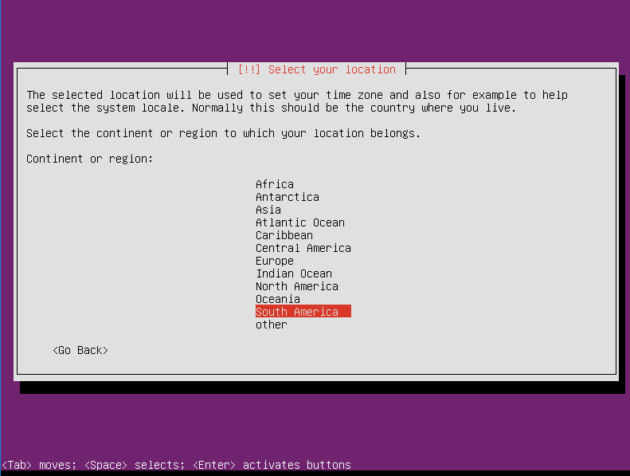
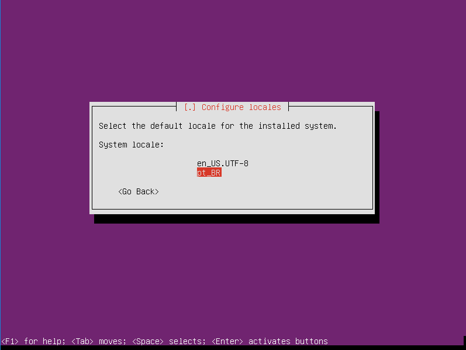
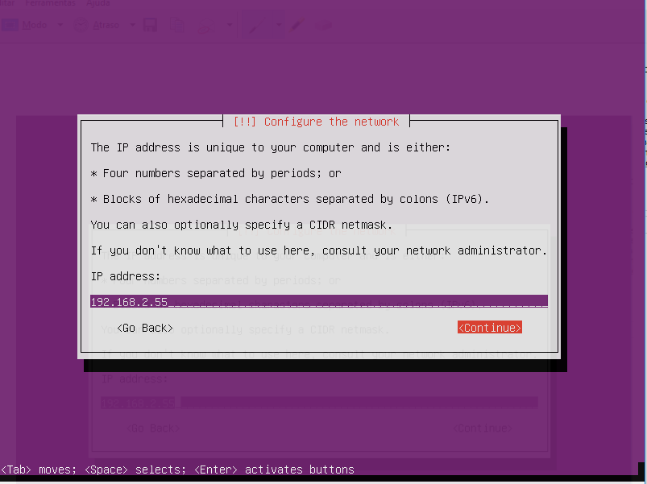
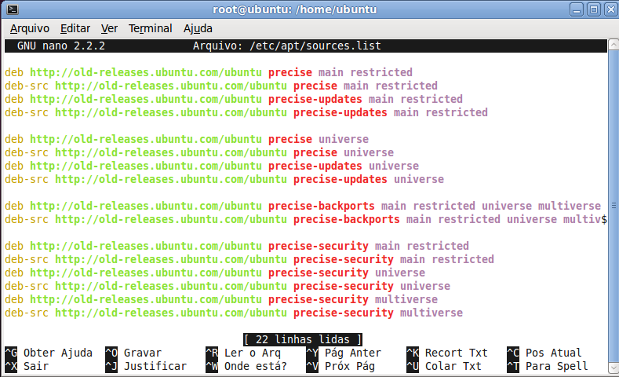

# Instalando-UBUNTU-Linux-CNC.
Objetivo é fazer uma instalação do Ubuntu Linux extremamente compacta,  Com a versão correta e com a imagem apropriada do kernel,  para o  Linux CNC.

# CONSIDERAÇÕES INICIAIS: 
- Objetivo deste post, é fazer uma instalação do Linux extremamente compacta,
- Utilizando imagem i386, pois amd64 não é suportada pelo kernel do linuxcnc.
- Porém você poderá utilzar um kernel do proprio linux (rt-amd64).
- Sem a necessidade de instalar pacotes e depois subtrai-los, já com versão correta e com a imagem apropriada para kernel do LinuxCNC. 

# PRÉ REQUISITOS:
- Um pendriver 2 GB.
- Um PC. (pode ser uma máquina mais antiga,com boot para pendriver), com uma HD (formatada). de 10 GB. Placa de rede, uma entrada USB e porta paralela (COM).
- Acesso a Internet. 

# TRABALHOS INICIAIS.
- Baixe o Ubuntu
- O LinuxCNC será executado na versão do Ubuntu Precise-(i386). Você pode baixar aqui:
http://old-releases.ubuntu.com/ubuntu/dists/precise/main/installer-i386/current/images/netboot/mini.iso
- Crie uma unidade USB inicializável.
- Baixe Rufus, para a criação de pendrives USB inicializáveis.  Rufus é um excelente utilitário para a criação de pendrives USB. inicializáveis. Não requer instalação: https://rufus.akeo.ie/
- Selecione um pendrive USB de 2 Gb ou maior. Todas as informações nele contidas serão sobrescritas

# INICIANDO A INSTALAÇÃO.
- Apos instalar o pendriver com o boot , espete o em uma unidade USB  no  PC que será instalado o Linuxcnc, e de o boot na maquina, e inicie a instalação.
- Utilize a opção => Adavances Options = Comannd line expert install
- Primeira tela:

- Selecione o idioma de sua preferência:
- Segunda tela:

- Terceira tela:

- Quarta tela:

- Quinta tela:

- Sexta tela:

- Sétima tela:

- Oitava tela:

- Nona tela:

- Selecione o "layout" do teclado:
- Décima tela:

- Décima primeira tela:

- Décima segunda tela:

- Décima terceira tela:

- Localização de componentes da rede.
- Décima quarta tela:

- Descomente.
- Décima quinta tela:

- Configurando a rede.
- Décima sexta tela

- Seguramente você poderá utilizar a opção "yes" que o Linux configurará a rede automaticamente.
- Mas se você gosta de um desafio!
- Décima sétima tela:

- Pesquise com antecedência o número do IP do seu roteador, Servidores DNS IPv4.
- Este numero vocé poderá encontrar no Windows na barra status da rede, configurações, Servidores DNS IPv4: 192.168.2.1
- Crie o gatewai de sua máquina Linux:
- Copíe as tres primeiras faixas, invente um na quarta  faixa.
- Obs: Não utilize "1" que é o número do seu roteador, não utilize, o mesmo número da máquina Windons!

- Décima oitava tela

- A máscara de rede poderá ser a mesma sugerida pelo Linux.
- No caso da imagem:
- Décima nona tela

- Deixe como aparecer, que estará correto!
- Vigéssima  tela:

- Deixe como aparecer, que estará correto!
- Vigéssima primeira tela:

- Confira e confirme:
- Vigéssima segunda tela:

- De um nome para sua máquina:
- Vigéssima terceira tela:

- Deixe em branco:
- Vigéssima quarta tela.

- Procurando provedor Linux.
- Vigéssima quinta tela:

- Vigéssima sexta tela

- Selecione o país
- Vigéssima sétima tela

- De enter:
- Vigéssima oitava tela:

- Deixe em branco.
- Vigéssima nona tela:

- Começando a  baixar os pacotes.
- Trigéssima tela

- Deixe em branco.
- Trigéssima primeira tela

- Trigéssima segunda tela:

- Pular configuração de senhas. 
- Configurar o relógio.
- Trigéssima terceira tela

- Trigéssima quarta tela:

- Trigéssima quinta tela:

- Trigéssima sexta tela:

- Detectando os díscos:
- Trigéssima sétima tela:

- Trigéssima oitava tela:

- Descomente.
- Trigéssima nona tela:

- Particionar o disco.
- Quadragéssima tela:

- Se a HD. foi formatada aparerá assim.
- Selecione o modo guiado.
- Quadragéssima primeira tela:

- Quadragéssima segunda tela:

- Escolha este modo proposto, que é o mais simples.
- Quadragéssima terceira tela:

- Confirme as mudanças.
- Quadragéssima quarta tela:

- Quando aparecer esta tela,  vamos dar "O Pulo do gato"
- Apertar  as  teclas ctrl+alt+F2
- Quadragéssima quinta tela

- Neste ponto, estamos com a partição /dev/sda1 montada em /target,

      mount -t ext4 -o rw /dev/sda1 /mnt/
- A onde iremos propriamente instalar o linux.
- Quadragéssima sexta tela:

- Tecle: 
- ~# cd /target
- ~# apt-key adv --keyserver hkp://keyserver.ubuntu.com:80 --recv 0C49F3730359A14518585931BC711F9BA15703C6
- ~# apt-key adv --keyserver keyserver.ubuntu.com --recv-keys 04EE7237B7D453EC
- ~# apt-get update
- ~# debootstrap --variant=minbase precise /target
- ~# mount -v --bind /dev  /target/dev
- ~# chroot /target /bin/bash
- ~# mount -vt tmpfs none /run
- ~# mount -vt proc none proc
- ~# mount -vt sysfs none /sys
- ~# mount -vt devpts devpts /dev/pts
- ~# mount -vt tmpfs none /tmp
- ~# export LC_ALL=C
- ~# apt-get update
- ~# apt-get install --no-install-recommends nano
- ~# nano /etc/apt/sources.list
- Edite sources.list com está fig

- Salve a edição: 
- Ctrl+x
- Y+enter
- Obs: o passo anterior, não poderá dar "erro", se houver algum erro, corriga novamente o arquivo editado.
- ~# apt-get update
- ~#  apt-get install --no-install-recommends netbase
- ~# apt-get install --no-install-recommends apt-utils dialog
- ~# apt-get install --no-install-recommends iputils-ping
- ~# apt-get install --no-install-recommends apt-file
- ~# apt-file update
- ~# apt-file search bin/ifconfig
- ~# apt-get install --no-install-recommends net-tools
- ~# apt-get install --no-install-recommends ifupdown
- ~# apt-get install --no-install-recommends isc-dhcp-client
- ~# apt-get install --no-install-recommends network-manager
- Edite /etc/hosts
- ~# nano /etc/hosts
- 127.0.0.1 localhost
- 127.0.1.1 Linux-cnc
- ctrl + x
- y + enter
- ~# apt-get install --no-install-recommends sudo
- ~# adduser user
- ~# password config
- ~# password confirm
- Full Name [ ]: user
- Room Number [ ]: enter
- Work Phone [ ]: enter
- Home Phone [ ]: enter
- Other [ ]: enter
- Is the information correct [Y/n}: y
- ~#  apt-get autoclean
- ~# usermod -a -G sudo user
- ~#  groups user
- O arquivo /etc/fstab deverá estar como na fig. abaixo.
- ~# cat /etc/fstab
- Obs: a numeração UUID aparecerá com outro valor  

- Atenção:
- Se deu tudo certo no começo, você pode pular esta parte da edição do fstab.
- ~# blkid > /etc/fstab
- ~# nano /etc/fstab
- proc	/proc	proc	nodev,noexec,nosuid	0	0 	
- #/dev/sda1
- UUID=************************** /ext4 errors=remount-ro 0 1
- #/dev/sda2
- UUID=**************************** none swap sw 0 0
- ctrl + x
- y + enter
- Lembre-se:  Não edite os valores da UUID, eles são únicos. se o fstab não estiver todo correto, pode causar problemas na sua inicialização.
- Continua........
- Instalando as chaves.
- ~# apt-key adv --keyserver hkp://keyserver.ubuntu.com:80 --recv-key 3cb9fd148f374fef

- Edite /etc/apt/sources.list
- Acrecente a linha no fim do arquivo e salve.
- ~# nano /etc/apt/sources.list
- deb http://linuxcnc.org/ precise base 2.7-rtai
- deb-src http://linuxcnc.org/ precise base 2.7-rtai
- ctrl + x
- y + enter

- ~# apt-get update
- ~# apt-get install --no-install-recommends initramfs-tools linux-image-3.4-9-rtai-686-pae rtai-modules-3.4-9-rtai-686-pae grub-pc

- ~# uname -r

- ~#  passwd
- Enter new UNIX password:
- Retype  new UNIX password:
- ~# exit
- ~# cd /
- ~# umount -lfv /target 
- ~# shutdown -r  now
- Reinicie a máquina!
- ~# apt-get install xfce4 synaptic linux-firmware

- 

- 

- 

- ~# shutdown -r  now
- Reinicie a máquina!
- ~# startx

- Abra o synaptic
- Instale o linuxcnc

- Instale o leafpad

# EXTRA
- Se você tiver problemas para carregar "parport".
- Abra promt de comando, tecle: lsmod
- Procure por "parport".

- Se não estiver carregado, "parport". tente editar /etc/rc.local como na fig. a baixo.
- Reinicie a máquina!

- Não menos importante!
- Abra o CNC => Stepconf Wizart
- Na aba certa edite como está na fig.abaixo!(porta paralela COM1)

- Pinagem (out/in) porta paralela:

#EXTRA DO EXTRA
- Outro método de instalar a interface gráfica no lugar do xfce4 é com o icewm, 
- Eu o chamo de "método autoflagelação":
- ~# apt-get install xinit icewm linuxcnc gedit nautilus linux-firmware
- Acesse o patinho fe..digo o sistema gráfico.
- ~# startx
- Abra com o gedit o arquivo /etc/X11/icewm/programs
- Edite o arquivo como na figura a baixo:

- Se tudo correr direito o resultado será este:

- Com o editor aberto edite também
- /etc/shadow
- A linha do root e deixe assim:

- Edite também rc.local e acressente
- Uma linha como na figura abaixo

- Reinicie a maquina

Data do post: 05-06-2019

# AVISO LEGAL
- OS AUTORES DESTE SOFTWARE NÃO ACEITAM ABSOLUTAMENTE A RESPONSABILIDADE POR QUAISQUER DANOS OU PERDAS RESULTANTES DE SEU USO.
- É EXTREMAMENTE NÃO CONFIAR EM SOFTWARE APENAS POR SEGURANÇA.

- Qualquer maquinário capaz de ferir pessoas deve ter provisões para remover completamente a energia de todos os motores, etc, antes que as pessoas entrem em qualquer área de perigo.
- Todas as máquinas devem ser projetadas para estar em conformidade com os códigos de segurança locais e nacionais, e os autores deste software não podem, e não assumem, qualquer responsabilidade por tal conformidade.
- Este software é lançado sob a GPLv2, com algumas partes sob a LGPL. Veja o arquivo COPYING para mais detalhes.
Instalando-UBUNTU-Linux-CNC

